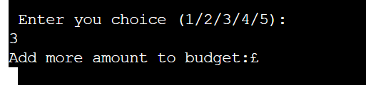
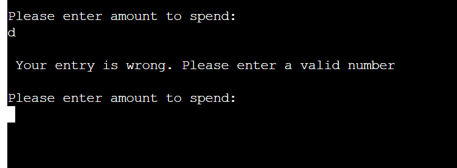

# Budget Tracker Project

The Budget Tracker Project is a Python application which runs in the Code Institute mock terminal on Heroku

The user can input their budget and then add their spendings description and amount and the application will calculate the remaining budget. 

[Here is a link to my live version of my project](https://budget-tracker-project-f6f2ed2617c9.herokuapp.com/)

## How the app works
The user will input their original budget and then they will be asked to select one of four choices (1/2/3/4/5)

The first choice is for the user to add spending description once that is entered the the app will ask the user to enter the amount spent. 

The second choice is for the user to check the budget balance and what were the spendings and amount spent. 

Choice three is for the user to add more amount to the original budget

Choice four resets the budget and spendings to zero so the user can add a new budget and spendings

Choice five is for the user to exit the app. When the user exits the app a goodbye message will be printed on the console

## Features
- User inputs their budget.

- User can choose one of the five choices.

- User adds a description of what they spent their money.
- User adds the amount of money they spent.

- User can check their balance and see on what they spent their money.
- The user will constant see their spendings until the tracker is reset.

- User can add more money to the original budget.

- The user will constant see their spendings.

- The user can reset their budget to zero and then add a new budget.

- When the user will exit the app a goodbye message will be printed.

## Data model

- I decided to use the Main function which checks all the other function to ensure that the Budget tracker app runs correctly. 

- The main function also has print methods which prints instructions for the user. 

- I have created a JSON file which updates and saves the data which the user inputs it in the terminal. The data is saved until the user chooses Choice 4 which resets the tracker and then exits the tracker. 

- I have created a flowchart to display the thinking behind the app. 

## Testing

#### I have manually tested the code

- I have passed the code through PEP8 linter and confirmed there are no problems
- Tested in my local terminal and in the Code Institute Heroku terminal

### Bugs

#### Bugs found

- I found that in the "Add you budget" if a letter or a symbol was typed on the console an error was typed
- In the Choice 1 the user was able to input a number or a symbol for the "Description of spendings".
- When an amount was asked to be inputted the user was able to input letters or symbols as well as numbers

#### Bugs solved

- I created an input validation for the original_budget variable so it only takes numbers. If anything, else than numbers are introduced the console will print a message.

- I created an input validation for the description so it only takes letters and spaces but cannot take empty spaces. If anything, else than letters are introduced the console will print a message.

#### Remaining bugs

- There are no remaining bugs.

### Validator testing

- PEP8
    - No errors were returned on [PEP8online.com](https://pep8ci.herokuapp.com/)

## Deployment

The main branch of this repository is the most current version and has been used for the deployed version of the site.
The Code Institute student template was used to create this project.

[Code Institute Template](https://github.com/Code-Institute-Org/p3-template)

1. Click **Use This Template** button.
2. Give your repository a name, and description.
3. Open [Github](https://github.com/) and log into your account.
4. Click **New Workspace** button.
5. Create a workspace from your project repository by creating a clone.

### How to deploy using Heroku

The project was deployed using Code Institute's mock terminal for Heroku 
1. Create new Heroku app
2. Set the buildbacks for Python and Node.JS in that order 
3. Link the Heroku app to your Github repository
4. Click on Deploy Branch
5. After Heroku installed all requirements click View

### Creating a clone

1. From the repository, click **Code**.
2. In the **Clone >> HTTPS** section, copy the clone URL for the repository.
3. Paste a link into the designated area on the github. 

### Forking

1. From the repository, click **Fork**.
2. Give your repository a name.
3. Click **Create fork**.

## Credits
- Code Institute for the deployment terminal
- YouTube and Google for various code assistance 

